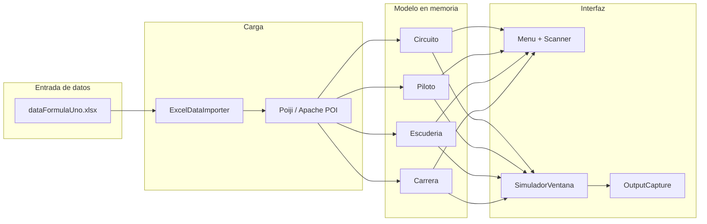
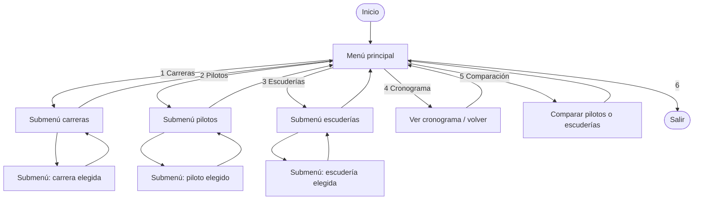
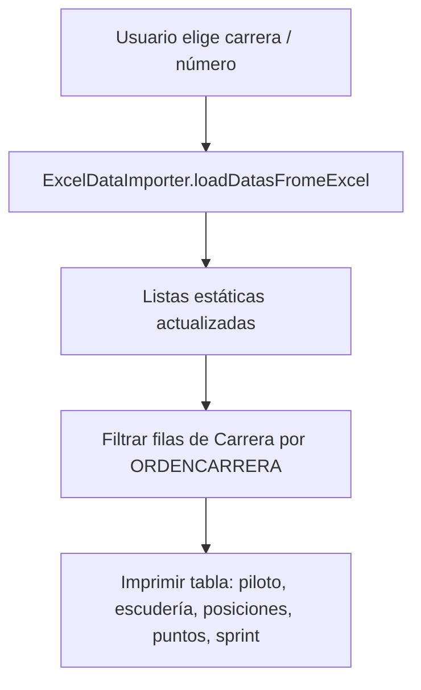

# Simulador Fórmula 1 (Java)

Proyecto académico de **Programación Orientada a Objetos** que simula un sistema de consultas sobre la temporada de Fórmula 1. Los datos provienen de un libro **Excel** (`dataFormulaUno.xlsx`) con varias hojas; la aplicación los lee, los mantiene en memoria y permite consultar circuitos, pilotos, escuderías, resultados por carrera, cronograma y comparaciones.

## ¿De qué trata?

El programa **no simula una carrera en tiempo real**, sino que actúa como un **visor interactivo** de información estructurada:

- Listar y consultar **circuitos / carreras**.
- Ver **fichas** de pilotos y escuderías.
- Consultar **puntos y posiciones** del mundial de pilotos y de constructores, **por carrera** o **por escudería**.
- Mostrar el **cronograma** ordenado por fecha.
- **Comparar** dos pilotos o dos escuderías carrera a carrera.

Todo ello apoyado en clases Java que modelan entidades (`Circuito`, `Piloto`, `Escuderia`, `Carrera`) y en menús (consola o ventana) que invocan la lógica de negocio.

## Cómo funciona (visión general)

1. **`ExcelDataImporter`** carga el archivo Excel (desde `src/main/resources`, carpeta de trabajo, variables de entorno o rutas configuradas; si falta, puede generarse un ejemplo mínimo).
2. **Poiji** mapea cada fila del Excel a objetos Java según anotaciones `@ExcelCellName`.
3. Las listas estáticas en cada clase (`getDataListCircuito()`, `getDataPilotos()`, etc.) almacenan los datos en memoria durante la ejecución.
4. **`Menu`** (consola) o **`SimuladorVentana`** (Swing) disparan métodos que leen esas listas, filtran y formatean salida por consola (en la UI, la salida se **captura** y se muestra en un área de texto).



## Estructura del proyecto (paquetes)

| Ubicación | Rol |
|-----------|-----|
| `org.example` | Clases de dominio (`Circuito`, `Piloto`, `Escuderia`, `Carrera`), `Menu`, `Main`, `MainConsola` |
| `org.example.data` | `ExcelDataImporter`, `Banner`, `GenerarArchivoExcel` (genera un Excel mínimo) |
| `org.example.ui` | `SimuladorVentana`, `OutputCapture` |

## Archivo Excel

El libro debe incluir hojas con estos **nombres exactos**: `ESCUDERIA`, `CIRCUITO`, `PILOTO`, `CARRERA`. Las columnas deben coincidir con los nombres en `@ExcelCellName` de cada clase.

- Ruta típica en el proyecto: `src/main/resources/dataFormulaUno.xlsx`.
- Más opciones y regeneración del ejemplo: ver `src/main/resources/LEEME_EXCEL.txt`.

## Cómo ejecutar

### Interfaz gráfica (por defecto)

Ejecutar la clase **`Main`** sin argumentos (desde el IDE o Maven). Se abre **`SimuladorVentana`** con pestañas equivalentes a las secciones del menú.

### Consola (menú con `Scanner`)

- Ejecutar **`MainConsola`**, o  
- Ejecutar **`Main`** con argumento: `consola`.

### Maven

```bash
mvn compile exec:java
```

Modo consola (si el plugin respeta `-Dexec.mainClass`; si no, usar el IDE):

```bash
mvn compile exec:java -Dexec.mainClass=org.example.Main -Dexec.args=consola
```

Requisitos: **JDK 21+** (según `pom.xml`).

## Diagrama de flujo: menús (consola)

La consola usa menús anidados por números. El siguiente diagrama resume las transiciones principales (las opciones numéricas concretas están en el código de `Menu.java`).



## Diagrama de flujo: una consulta típica (lógica)

Ejemplo: “Mundial de pilotos en una carrera concreta”.



## Dependencias principales

- **Poiji**: lectura de Excel → beans Java.
- **Apache POI** (`poi-ooxml`): generación del Excel de ejemplo / plantilla.
- **Log4j** (implementación SLF4J): logging de librerías.

## Licencia / uso

Proyecto académico; adapta la licencia según las normas de tu centro.
